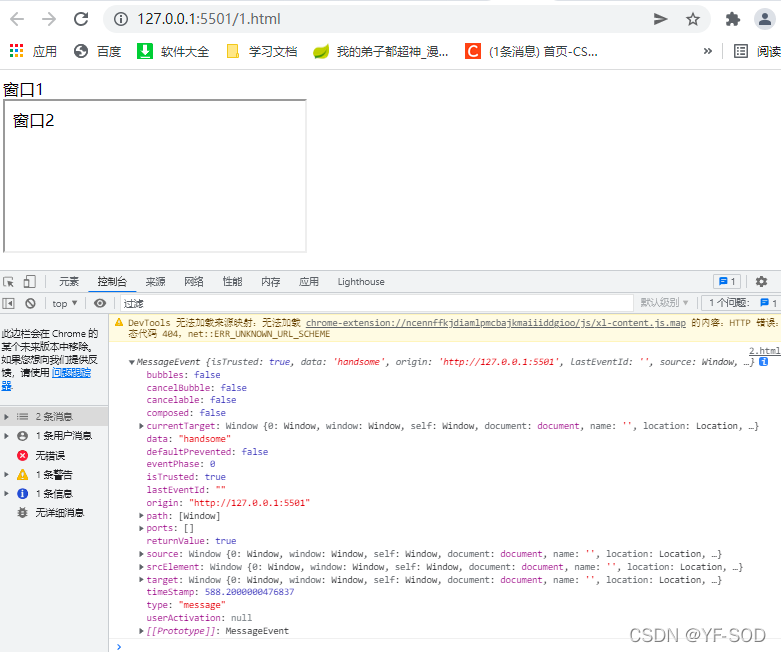

# iframe 遇到的相关问题

> 父子页面嵌套，协议不一致问题处理 
#### 解决方式：可以采用 "//xxx.xxx.xxx" 类似的访问方式来解决，使子页面自动取获取父页面使用的协议即可

```html
<!--父页面 域名 https://www.test.com-->
<!doctype html>
<html lang="en">
<head>
    <meta charset="UTF-8">
    <meta name="viewport" content="width=device-width, user-scalable=no, initial-scale=1.0, maximum-scale=1.0, minimum-scale=1.0">
    <meta http-equiv="X-UA-Compatible" content="ie=edge">
    <title>Document</title>
</head>
<body>
  <iframe src="//www.child.test.com" frameborder="0"></iframe>
</body>
</html>
<!--子页面 域名 https://www.child.test.com-->
<!--上面的src方式可以使子页面动态获取父页面使用的协议-->
<!--需要注意的一点是，服务器端可以控制当前页面是否可以引入iframe-->
```
#### tips：`http有一个X-Frame-Options选项，可以设置不允许其他网站使用iframe链接，比如百度设置了只允许同源网站嵌套，除了设置成SAMEORIGIN，也可以设置成DENY，拒绝所有的网站嵌套。`

### 配置方法
```text
// Apache
Header always set X-Frame-Options "SAMEORIGIN"
Header set X-Frame-Options "DENY"

// Nginx
add_header X-Frame-Options SAMEORIGIN always;

// IIS
<system.webServer>
  ...
  <httpProtocol>
    <customHeaders>
      <add name="X-Frame-Options" value="SAMEORIGIN" />
    </customHeaders>
  </httpProtocol>
  ...
</system.webServer>

// Express
const helmet = require('helmet');
const app = express();
app.use(helmet.frameguard({ action: 'SAMEORIGIN' }));
```
> 父子页面通讯问题 postMessage、message

###### 1、用来实现安全的跨域通讯，通常对于两个不同页面的脚本，只有他们执行的页面处于相同，协议、端口号、主机( Document.domain设置为相同的值)
###### 2、从广义上讲，一个窗口可以获得对另一个窗口的引用（比如 targetWindow = window.opener），然后在窗口上调用 targetWindow.postMessage() 方法分发一个  MessageEvent 消息。接收消息的窗口可以根据需要自由处理此事件 (en-US)。传递给 window.postMessage() 的参数（比如 message ）将通过消息事件对象暴露给接收消息的窗口。
|  参数   | 说明  |
|  ----  | ----  |
| window  | 窗口的一个引用，比如 iframe 的 contentWindow 属性、执行 window.open 返回的窗口对象、或者是命名过或数值索引的 window.frames |
| message  | 只能为字符串，将要发送到其他 window的数据，对象类型需要使用JSON.stringify |
| targetOrigin  | 指定哪些窗口能接收到消息事件，其值可以是 *（表示无限制）或者一个 URI（注意指定URI不支持跨域，会报错，而*号支持跨域） |
| transfer  | 可选，是一串和 message 同时传递的 Transferable 对象。这些对象的所有权将被转移给消息的接收方，而发送一方将不再保有所有权。Transferable 接口代表一个能在不同可执行上下文之间，列如主线程和 Worker 之间，相互传递的对象。 |

```html
<!DOCTYPE html>
<html lang="en">
 
<head>
    <meta charset="UTF-8">
    <meta http-equiv="X-UA-Compatible" content="IE=edge">
    <meta name="viewport" content="width=device-width, initial-scale=1.0">
    <title>Document</title>
</head>
<body>
    <div>窗口1、端口5050</div>
    <iframe src="http://127.0.0.1:5501/2.html" frameborder="1" id='123' name="abc"></iframe>
    <script>
        window.onload = function () {
            setTimeout(() => {
                window.top.postMessage('handsome', '*')
            }, 0)
        }
    </script>
</body>
</html>

<!DOCTYPE html>
<html lang="en">
<head>
    <meta charset="UTF-8">
    <meta name="viewport" content="width=device-width, initial-scale=1.0">
    <title>窗口1、端口5501</title>
</head>
<body>
<div>窗口2</div>
<script>
    // window.top 可以获取到嵌套当前页面的 window实例
    // 只有在没有iframe嵌套的情况下 window.top === window 返回true,
    // 存在iframe嵌套的情况下 window.top === window 返回false,
    top.addEventListener('message',(e)=>{console.log(e)},false)
</script>
</body>
</html>
```
执行结果


> [参考资料 window.top](https://developer.mozilla.org/en-US/docs/Web/API/Window/top)
```javascript
// 只有在没有iframe嵌套的情况下 window.top === window 返回true,
// 存在iframe嵌套的情况下 window.top === window 返回false,
```
