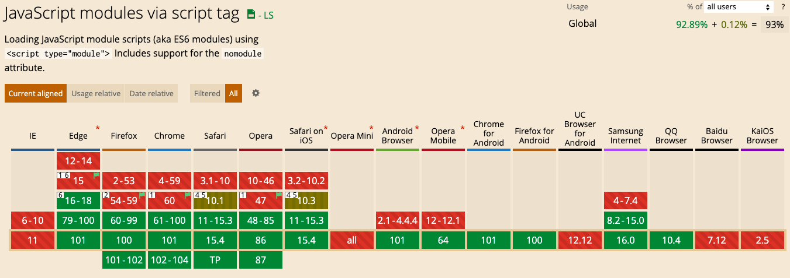

# import ES Module 使用详解

> [参考文档](http://www.wawow.xyz/#/md-render?bid=39)

一、ES Module是什么

> 历史上，javascript历史上从来没有出现过模块化(module)的体系,无法将一个庞大的功能拆分为相互依赖的小文件，在用简单的办法拼接起来，但是其他的语言都是存在这样的功能的，eg: Python的import，就连CSS也存在@import操作，但是
> javascript在这个方面没有任何的支持，对于开发大型复杂的项目，形成了巨大的障碍。
> 在ES6之前，社区执行了一些模块性质的加载方案Commonjs和ADM,成为浏览器和服务器的通用解决方案。
> ES6的设计思想是尽量的静态化，使得编译的时候就能确定模块的依赖关系，以及输入和输出的变量。
> Commonjs和ADM只能在运行的时候来确定，比如，CommonJS 模块就是对象，输入时必须查找对象属性。

二、浏览器的兼容情况



三、ES module 和 Commonjs的区别

>ES module 输出的是值的引用，Commonjs输出的是值的拷贝
>ES module 是编译的时候执行，Commonjs是运行的时候加载
>ES module 可以导出多个值，Commonjs是单个值的导出
>ES module 静态语法只能写在最顶部，Commonjs动态语法可以写在判断条件里面
>ES module 的this执向的是 undefind，Commonjs this指向的是当前模块

**CommonJs的使用**
```javascript
// CommonJS模块
const { state, exists, readfile } = require('fs')
// 等同于
const _fs = require('fs')
let stat = _fs.stat;
let exists = _fs.exists;
let readfile = _fs.readfile;
```
上面代码的运行流程是整体加载fs模块(也就是加载fs的全部方法)，然后生成一个对象，然后在从对象上面取出需要加载的方法，这种加载称之为"加载时候运行"，因为之后运行的时候才能得到这个对象，导致他没有办法在做编译的时候静态化

**ES6 module的使用**
```javascript
// ES6模块
import { stat, exists, readFile } from 'fs';
```
ES6模块加载的实质是从fs里面加载三个方法,其他的方法不进行加载，这种加载称之为""编译时加载、静态加载"，ES6可以在编译的时候就完成模块的加载，效率要比CommonJs的效率高很多，这样也会导致没有办法引用ES6模块自身.(>ES module 的this执向的是 undefind，Commonjs this指向的是当前模块)
由于ES6模块是编译时候加载，是的静态分析成为可能，有了它，就能进一步拓宽 JavaScript 的语法，比如引入宏（macro）和类型检验（type system）这些只能靠静态分析实现的功能。

除了静态加载带来的各种好处，ES6 模块还有以下好处。
* 不需要再使用UMD格式，现在浏览器和服务器都会支持ES6模块化
* 浏览器中新的API就可以用模块化来提供了，不必做成全局对象了
* 不需要再使用对象作为命名空间了，这个功能可以通过模块来实现了

三、ES Module相关语法

> export 命令

* **export**命令用于规定模块的外部接口，即外部引用的部分
* **export**命令规定的是对外的接口，必须与模块内部的变量建立一对一的联系
* **export**语句输出的接口，与其对应的值是动态绑定关系(地址引用)，通过这个接口可以取到模块内部的实时的值
* **export**命令可以出现在模块的顶层作用域中，如果出现在块级作用域内部就会报错

> import 命令

* **import**用于输入其他模块提供的功能，通过import加载引入的模块
* **import**输入的值是只读的，他的本质是接口的输入，不允许在模块加载的文件修改输入的值，但是如果输入的是一个引用变量一个对象，改写引入变量的属性是可以的(导出一个对象，引入的文件中可以修改对象的属性)
* **import**后面的from指定模块的位置，可以是相对路径、绝对路径
* **import**命令会有提升的效果，会提升到整个模块作用域的头部，首先执行
* **import**是静态执行的所以在，引入的语句中不能存在表达式或者是变量(CommonJS可以的)

```javascript
// 引入提升
a();
import { a } from 'test';

// 整体引入
import * as b from 'test';
b.fn();

// 修改引入对象的属性
b.c = [];
```

```javascript
// 报错：引入使用 表达式
import { 'he' + 'llo' } from 'sayHi';

// 报错：引入使用 变量
let module = 'sayHi';
import { hello } from module;

// 报错：引入使用 代码块结构
if (x === 1) {
  import { hello } from 'sayHi';
} else {
  import { baybay } from 'sayHi';
}
```
上面引入都会报错，因为在静态分析阶段，这些语法都是没法得到值的。
>报错的原因是：import命令会被javascript静态解析，优先于模块的其他语句执行
> 引擎在处理import语句是在编译的时候，这时候不会去分析或者执行表达式、变量、代码块，所以变量、表达式之类无法使用在import之后

>export default
按照正常的逻辑，使用import的时候需要知道，要加载的变量名字或者函数，但是为了方便ES6 添加了默认的导出
