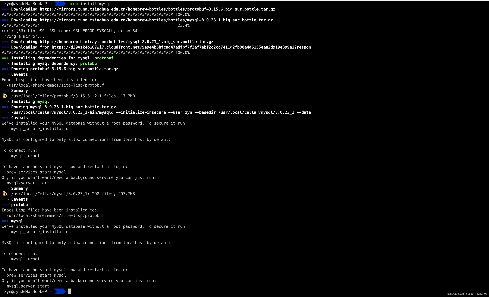
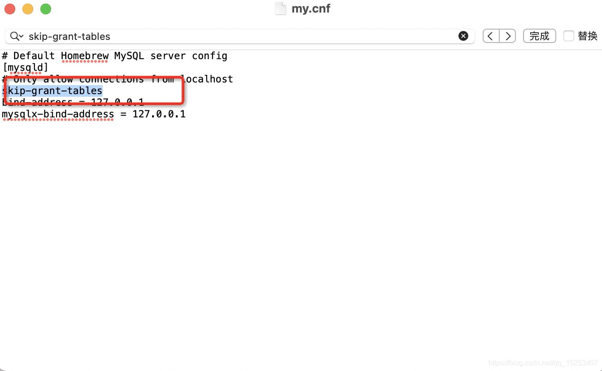
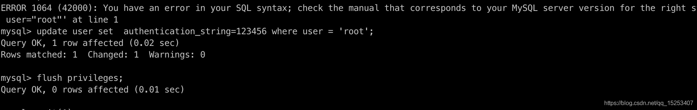

# brew install mysql 版本8.0.23
```text
一、配置文件位置

/usr/local/etc

二、启动方式
brew services start mysql 启动
brew services restart mysql 重启
```



```text
三、安装后本地登录root没有密码决绝方式

在配置文件中添加

skip-grant-tables // 进行免密码登录
```



```text
// mysql下面的用户信息存在 表 mysql

// 查询原有数据

select host,user,authentication_string,plugin from user;
```


```text
use mysql

// 创建一个新用户
```


```text
// 注意上面出现ERROR 1290 (HY000): The MySQL server is running with the --skip-grant-tables option so it cannot execute this statement

执行// flush privileges;

再次重新设置
create user ‘zynAdmin’@’%’ identified with mysql_native_password by ‘123456’

上面host % 代表可以被外网进行访问，不局限于 本机
```


```text
// 注销上面配置文件中的 skip-grant-tables
```


```text
zynAdmin

123456
/// 重启

mysql -u root -p123456
```
